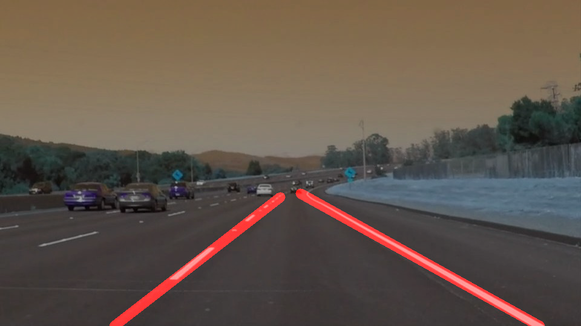
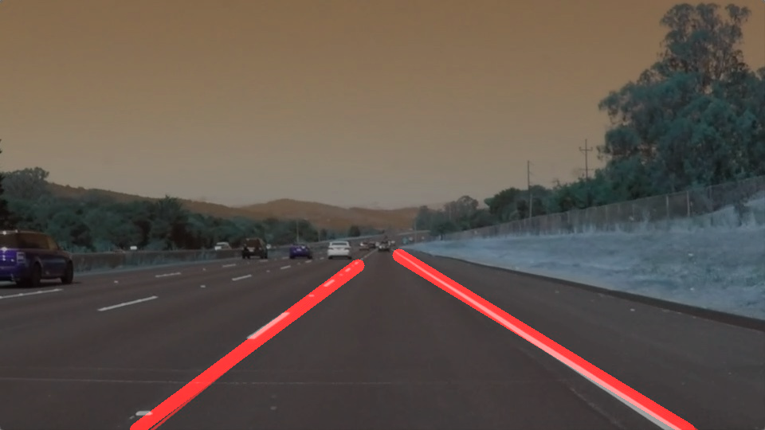

# **Finding Lane Lines on the Road** 

## 	Building pipeline Steps
	•	Load image
	•	Apply grayscale()
	•	Apply canny()
	•	Apply gaussian_blur()
	•	Apply region_of_interest()
	•	Apply draw_lines()
	•	Apply hough_lines()

###  Input and Output of images

  
  
  
  
  
  
  
  
  
  
  
  

### Reflection

### 1. Describe your pipeline. As part of the description, explain how you modified the draw_lines() function.

Function draw line was modified to extrapolate the line. The way to do it was to calculate mean slope and intercept and draw line between highest point and lower edge of the image and Overlay with original picture. 

### 2. Identify potential shortcomings with your current pipeline

#### Classification of lines
The classification of lines falls short when there are lines on the road surface. Here a better classification would be needed, that isn't just dependent on the steepest slope. One possibility would be a plausibility check of the slope. For example only allowing the slope to be between 0.5 and 0.9.

#### Hough parameters
The hough function uses absolute values for threshold, min_line_len and max_line_gap that were derived from the provided low resolution videos. They don't work very well on a higher resolution video like the challenge video. One possible solution would be the usage of relative values depending on the size of the image.

#### Smoothing of line
in the videos the detected lane lines are jittering quite bad, especially in the challenge video. A smoothing between the frames would solve this. 

### 3. Suggest possible improvements to your pipeline

A possible improvement would be to ...

Another potential improvement could be to ...
